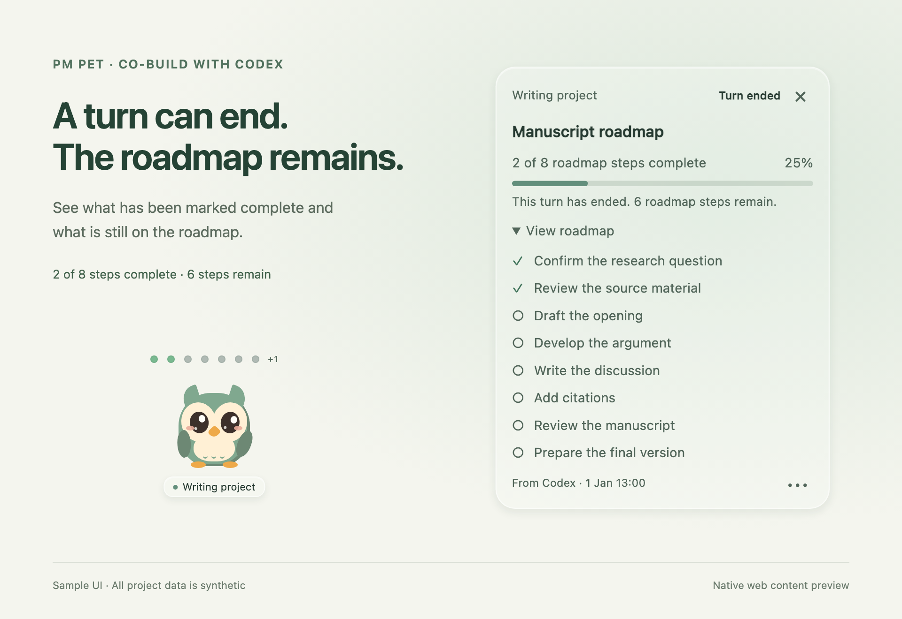

# PM Pet

**A small desktop companion for co-building with Codex.**

Keep the plan visible, return to the decisions that need you, and see your available quota—all through a little owl at the corner of your Mac.


[Start each new task](#start-each-new-codex-task) · [Install](#install) · [How it works](#how-it-works) · [Controls](#controls) · [Current limits](#current-limits) · [Contribute](CONTRIBUTING.md)

**Source preview · 0.1.0-alpha.1 · macOS 13+ · Codex Desktop · [MIT](LICENSE)**

## Start each new Codex task

[Install once](#install), then **explicitly enable PM Pet at the beginning of every new root Codex task you want it to follow**. This includes new tasks in a project folder you have used before. Each conversation opts in separately.

If you installed the skill with `--with-skill`, start the task with:

> Use $pm-pet to enable a Pet for this conversation, named “My build”. Check my current Codex usage once to initialize quota updates. Clarify important choices before building, then keep its roadmap updated as we work.

For a command-only installation, ask Codex to run this **inside that root task**:

```sh
~/.local/bin/pm-pet enable --title "My build"
```

After enabling, ask Codex to check your current usage once with its Desktop usage-limits tool. This supplies the account check needed for conditional automatic quota updates; enabling Pet alone does not verify the quota account.

**`enable` binds or re-enables the current conversation. `start` reopens saved, enabled Pets.** Running `pm-pet start` does not bind a new task or re-enable a disabled Pet. Pets follow conversation IDs, not project folders; installing or starting the app does not enable all chats or add a startup item.

## Why PM Pet?

Building with an agent is still a collaboration. You bring the context, priorities, and judgments that determine whether the result fits your needs. PM Pet keeps that collaboration visible without turning your desktop into another dashboard.

- **A roadmap you can glance at.** See completed steps, current work, and what comes next. Collapse the panel into a small row of dots.
- **Human input at meaningful moments.** A yellow lantern draws attention to an important decision. A red reminder points to required information. Answer in the original Codex conversation or input window.
- **A little life on your desktop.** The owl reads while work is underway, casts a spell when a step completes, and gains chicks when child agents appear.
- **Quota within reach.** Optional usage pills show the remaining quota windows your account actually supplies, including weekly-only accounts.
- **One conversation, one Pet.** Enable up to five independent Pets, with different colors, editable names, and their own roadmaps. Two tasks in the same project stay separate.

## How it works


1. **Clarify.** Enable PM Pet in a Codex task. The included skill asks Codex to clarify consequential uncertainties before building or delegating.
2. **Build.** Codex reports the roadmap and verified milestones. Pet shows progress; ordinary tool activity alone does not complete a step.
3. **Bring you in.** When an important choice needs your judgment, Codex asks and Pet calls attention to it. For example: “When registration fills up, close it or start a waitlist?”
4. **Review and continue.** After your answer, Codex reviews the impact, updates the plan, and continues. Optional setup can be deferred with **Not now**.

This is a **human-in-the-loop (HITL)** workflow. The skill instructs Codex to stop this build's work before asking and wait for your reply. The Pet keeps the question pending until the reply is correlated and the plan reviewed. **The companion itself does not forcibly suspend every running agent or tool.** See [the feedback mechanism](docs/FEEDBACK-GATE.md) for the distinction and the optional tool guard.

The illustrations above use sample tasks and quota values.

## Install

You need **macOS 13 or later**, **Python 3.9+**, **Git**, Apple's command-line developer tools, and **Codex Desktop with local conversations**. This version builds on your Mac; there is no signed, notarized app download yet. The native interface has been tested on macOS 26.6.2 / Apple silicon. macOS 13 is the deployment target; earlier macOS releases and Intel have not been verified.

For automatic quota updates only, also install Codex CLI with a matching ChatGPT file-based login (tested with CLI `0.148.0`). This is optional for Pet's roadmap and reminder features.

If Apple's developer tools are missing, install them with `xcode-select --install`. Then:

```sh
git clone https://github.com/RichradsY/pm-pet.git
cd pm-pet
python3 scripts/setup.py install --with-skill
```

The installer creates `~/.local/bin/pm-pet` and, because you explicitly supplied `--with-skill`, installs the PM Pet skill. Keep this checkout: the installed command uses it. Installation does not enable a conversation, trust hooks, or add a login item. The first enable builds and opens the app.

For another command prefix, installation without the skill, removal, and diagnostics, see the [installation guide](docs/INSTALLATION.md).

### Enable it in Codex

Repeat this in each new root task you want to co-build in. The `$pm-pet` recipe requires the optional skill installed with `--with-skill`; if that newly installed skill is not listed, open a new task. Ask:

> Use $pm-pet to enable a Pet for this conversation, named “My build”. Check my current Codex usage once to initialize quota updates. Keep its roadmap updated as we work. Before building, ask me about any unresolved choice that would materially change the product, experience, time, or cost. Wait for my answer at those points, then review the plan and continue.

For a command-only installation, or direct use, ask Codex to run this in the owning task:

```sh
~/.local/bin/pm-pet enable --title "My build"
```

A terminal outside Codex needs an explicit `--conversation <exact-uuid>`. A project path or conversation title is not an identity. The [integration guide](docs/LOCAL-INTEGRATION.md) explains direct use and the [report contract](integrations/codex/pm-pet/references/report-contract.md).

### Update or remove

To update a Git checkout installation, quit the app before rebuilding:

```sh
~/.local/bin/pm-pet quit
cd /path/to/pm-pet
git pull --ff-only
~/.local/bin/pm-pet build
~/.local/bin/pm-pet update
~/.local/bin/pm-pet start
```

`update` refreshes the installed command and optional skill from your checkout. It does not fetch Git changes. The commands above rebuild the native app as well.

```sh
~/.local/bin/pm-pet disable       # Stop tracking this conversation
~/.local/bin/pm-pet quit          # Close Pet and its local bridge
~/.local/bin/pm-pet uninstall     # Remove owned installation files
```

Uninstall preserves the checkout and Pet's local data by default. See [removal options](docs/INSTALLATION.md#uninstall) for explicitly removing runtime data. Disabling, quitting, and uninstalling Pet do not answer questions or stop Codex work.

## Controls

| Interaction | Result |
| --- | --- |
| Click the owl | Show or hide its progress panel |
| Double-click the owl | Return to its exact Codex conversation |
| Double-click the Pet name or progress header name | Edit the Pet's display name |
| Drag the owl | Move it on your desktop |
| Click a roadmap dot | Open the full roadmap |
| Pet menu | Rename, resize, restore hidden quota, or disable this Pet |
| **Open Codex to reply** | Return to the conversation to answer |
| **Not now** | Defer an explicitly optional setup step |

Roadmap dots use **green** for completed, **deep green** for current, **gray** for pending, **yellow** for a decision, and **red** for required information. Labels identify the states too. Pet supports 75%–150% size presets and respects reduced motion and reduced transparency.

To rename a Pet, double-click its name or choose **Rename Pet…** from its menu. You can also focus the name and press Enter or F2. Enter or leaving the field saves; Esc cancels. Names must contain 1–100 characters and persist across restarts. Renaming a Pet does not change the Codex conversation's title or identity. If saving fails or cannot be confirmed, the editor keeps your draft and shows a message.

### What the progress measures

Progress covers the **reported roadmap**, which may span several Codex turns. A finished reply does not mean every roadmap item is finished. For example, completing two preparation steps can leave six drafting and review steps for later: the roadmap correctly remains at **2 of 8**, even after that turn ends.

The panel names this **Roadmap progress** and explains when a turn has ended with steps remaining. Gray dots mean **not marked complete**; a step may be planned for later or partly done. Only a verified plan update changes its completion status.



### When Codex stops to ask

When Codex finishes its current turn, the panel says **Turn ended**. An unanswered question stays visible with **This turn has ended. Reply in Codex to continue.** The conversation remains available for your next message. Open the matching conversation and submit your answer on its question card or send it as a normal chat message. Opening the conversation alone does not submit a reply.

A normal chat message first shows **Message received / Awaiting review**. Codex checks which question it answers; unrelated messages leave the question open. A correlated card reply, or an explicitly verified chat answer, advances the question count. Partial answers show which question is still waiting.

After all items are answered, Pet shows **Reply received / Awaiting review** with a calm owl. Codex reviews the answer's effect and updates the roadmap before continuing. The Pet reports message arrival and verified progress separately; receiving a message never means an automatic approval.

### About quota

The display shows **remaining**, shared account quota—not consumption attributable to one Pet. Only the first newly enabled Pet shows it by default; enable extra copies from each Pet's menu.

- Five-hour and weekly windows appear only when supplied. A missing five-hour limit is not displayed as zero.
- Hidden quota can be restored from the menu.
- The line below the pills shows **remaining** quota and the snapshot's age. After five minutes, **Cached** and an asterisk mark an old figure. Repainting does not make it fresh.

**After enabling Pet, ask Codex to check current usage once.** Pet observes the genuine Desktop result and verifies that its local CLI account matches that last Desktop account check. When that check succeeds and quota is visible, one shared background worker reads usage directly: every **60 seconds during confirmed running work**, or **5 minutes while idle or awaiting your reply**, scheduled after a successful read. Refreshes do not send model prompts. Hiding all quota displays or disabling all Pets stops polling and cancels an in-flight read.

**Auto** identifies the matched CLI source. **Checking**, **Retry**, and **Account check needed** describe refresh status. A failed read backs off while preserving the previous value's real age; an account mismatch makes quota unavailable. The percentage can stay unchanged after a successful read—the timestamp shows that it was checked again. General quota remains separate from Spark's allowance.

This match is to the **last Desktop check**, not a permanent live connection to Desktop identity. File-based CLI login metadata must be available; keychain-only or unmatched accounts do not enable automatic reads. If the account changes or a check is needed, check usage again in Codex. Pet keeps no raw account IDs, tokens, or credit balances in its state. See [the account and refresh details](docs/LOCAL-INTEGRATION.md#quota-sources-and-automatic-refresh).

## Current limits

This is an experimental source preview, intended for people comfortable building a small macOS app.

| Area | Current boundary |
| --- | --- |
| Agent support | Local Codex Desktop conversations. Claude Code, Hermes, and Pi are not connected yet. |
| Roadmap | The owning agent must report meaningful steps and completion. Pet does not infer a finished feature from tokens or elapsed time. |
| Human questions | The observed Desktop async-question format is automatic; other question formats need explicit agent reports. |
| Approvals and passwords | Computer Use approvals and OS password prompts are not detected automatically. Required-information reminders need a known prompt. Enter sensitive information only in its original window. |
| Execution control | Cooperative skill workflow and a persistent report gate. The optional reviewed hook guards supported future calls; it cannot cancel in-flight work. |
| Compatibility | Local transcript formats can change across Codex versions. Unsupported data must remain unavailable rather than be guessed. |
| Distribution | Source installation, local compilation, and ad hoc signing. No notarized binary, Homebrew cask, iOS app, or auto-updater. |

Pet's bridge reads the conversations you explicitly bind and keeps local state in this checkout's ignored `.pm-pet/runtime/` folder. It does not upload those records or copy answer values into Pet state. Question text, conversation IDs, and timestamps are still local data: do not attach that folder to a public issue.

## Explore and contribute

No Mac available? Open [`prototypes/pm-pet-multi.html`](prototypes/pm-pet-multi.html) locally in a browser to explore the five-Pet design. Its tasks, quota, and agent activity are simulated. The original [single-Pet animation study](prototypes/pm-pet-desktop.html) is also included.

- [Contributing and checks](CONTRIBUTING.md)
- [Product specification](docs/PRODUCT.md)
- [Local integration](docs/LOCAL-INTEGRATION.md)
- [Feedback and cancellation](docs/FEEDBACK-GATE.md)
- [Development roadmap](docs/APP-DEVELOPMENT.md)
- [Versioning](docs/VERSIONING.md) · [Changelog](CHANGELOG.md)

## Contributors

- [RichradsY](https://github.com/RichradsY) — Creator and maintainer; product direction and user testing.
- **[Codex](https://github.com/codex) by OpenAI** — AI assistance with implementation, debugging, testing, and documentation.

## License

[MIT](LICENSE). You can use, modify, and share PM Pet under its license terms. PM Pet is an independent project and is not affiliated with or endorsed by OpenAI.
